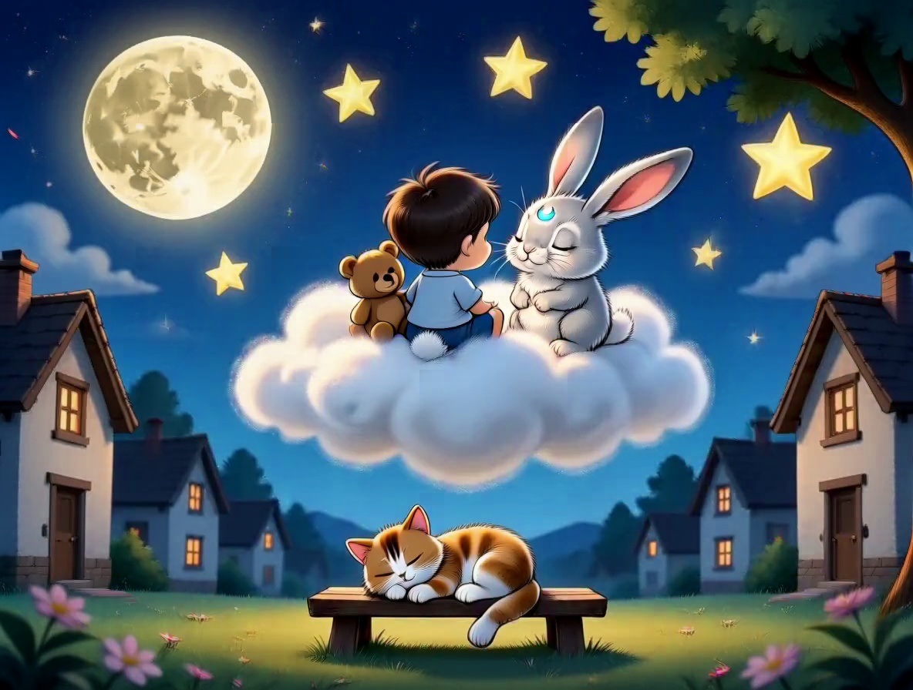

# Egy álmatlan este

Egyszer volt, hol nem volt, volt egyszer egy {kisfiú|kislány}, akit úgy hívtak: {nev}. Egy este {nev} már megfürdött, fogat mosott, felvette a puha pizsamáját, és bebújt az ágyba {plussz+val}. Megkapta az esti puszit is, eloltották a nagylámpát, de az álom sehogy sem akart megérkezni.

{nev} forgolódott jobbra, forgolódott balra. A párnája hol túl meleg volt, hol túl hideg, a takarója hol lecsúszott, hol a fejére került.

– Nem tudok elaludni – suttogta {plussz+nak}.

{plussz} csendben hallgatott, ahogy a plüssök szoktak, de mintha egy kicsit rákacsintott volna.

Ekkor besütött a hold az ablakon, és a holdsugáron lassan, puhán lecsúszott valaki: egy ezüstös bundájú, hosszú fülű nyuszi.

# A Holdnyuszi

– Jó estét – mondta halk, puha hangon. – Én vagyok a Holdnyuszi. Minden este meglátogatom azokat a gyerekeket, akiknek az álma eltévedt útközben. Segítsek megtalálni?

{nev} bólintott. A Holdnyuszi leült az ágy szélére.

– Az álom nagyon félénk – magyarázta. – Csak akkor jön közel, ha minden csendes és lassú. Először lassítsuk le a lélegzetünket. Tedd a kezed a pocakodra!

{nev} a pocakjára tette a kezét.

– Most szívd be a levegőt lassan, mintha egy virág illatát szagolnád… egy, kettő, három. És fújd ki lassan, mintha egy gyertyát akarnál elfújni, de csak nagyon óvatosan… egy, kettő, három, négy.

A pocak felemelkedett, mint egy kis hajó a hullámon, aztán lassan lesüllyedt. Még egyszer. És még egyszer.

# Az álmos testrészek

– Nagyon ügyes vagy – suttogta a Holdnyuszi. – Most pedig megkérdezzük a lábujjaidat, álmosak-e már.

– Jó éjszakát, lábujjak – mondta. És a lábujjak elnehezültek, mint a meleg homok.

– Jó éjszakát, lábak – és a lábak elernyedtek, mint a főtt spagetti.

– Jó éjszakát, pocak – és a pocak ellazult, mint egy puha felhő.

– Jó éjszakát, kezek – és a kezek elpihentek a takarón, mint két alvó kiscica.

– És jó éjszakát, szemhéjak – suttogta a Holdnyuszi a legeslegkisebb hangján. A szemhéjak pedig lassan lecsukódtak, mint két langyos kis takaró.

# Utazás a felhőn

Álmában {nev} egy puha, fehér felhőn ült, az ölében {plussz+val}. A felhő lassan, ringatózva úszott a csendes város fölött. Lent aludtak a házak, aludtak a fák, a padon aludt egy macska, a fészkében aludt egy rigó. Még a szél is lábujjhegyen járt.

A Holdnyuszi halkan számolta a csillagokat:

– Egy csillag… két csillag… három csillag…

Minden csillag egy kicsit halványabban pislogott, mint az előző. Mire a hetedikhez értek, {nev} már nem számolt.

A Holdnyuszi betakarta, és egy ezüstös puszit nyomott a homlokára.

– Szép álmokat, {nev} – suttogta, és visszaugrott a holdsugárra.

A szobában csend lett, meleg és nyugodt csend. {nev} pedig mélyen, édesen aludt reggelig, {plussz} ott szuszogott mellette.
